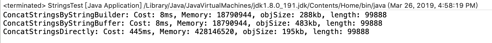
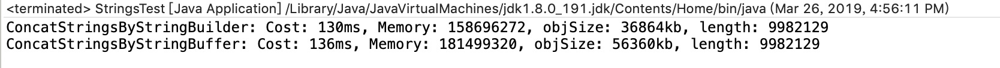

## 测试String, StringBuffer, StringBuilder的拼接速度, 内存使用情况比较.

> 测试采用随机数拼接, 指定数量的随机数初始化的list进行循环顺序拼接.

详细代码在[test](https://dev.tencent.com/u/shotaconXD/p/Test/git)中.

图中分别是 1万和100万的测试数据. 100w的测试中没使用字符串拼接, 太慢了.

在比较中发现StringBuffer会比StringBuilder多近一倍的内存占用.

原因是因为StringBuffer在对象实例内会存有toString的缓存, 详情参考[bufferInfo.txt](https://dev.tencent.com/u/shotaconXD/p/Test/git/blob/master/Nebula-web/src/test/java/stringtest/bufferInfo.txt)文件第八行. 

这个改动是1.8新增的, 所以在1.7及以前是没有的. 不过不用担心, 该变量不参与序列化.

具体就是在toString的时候会生成一个cache数组, 作为缓存使用.

所以在非多线程环境中, 尽(必)量(须)使用StringBuilder作为字符串拼接工具.

